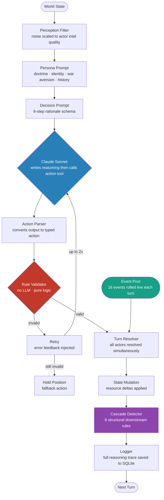
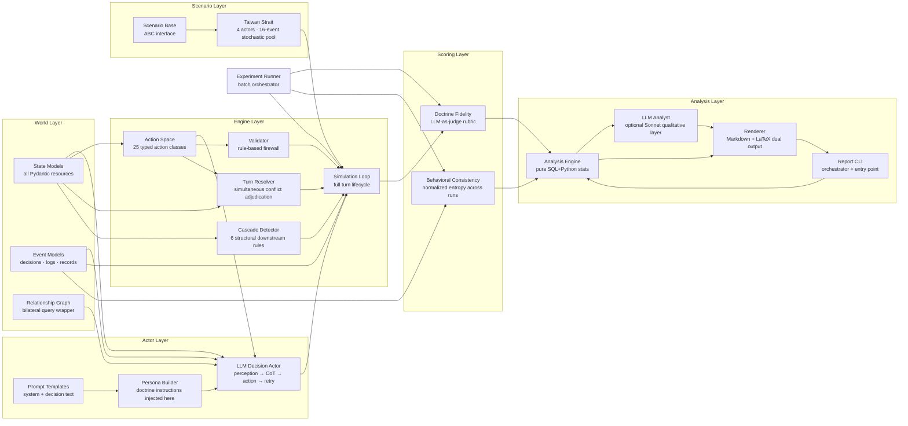
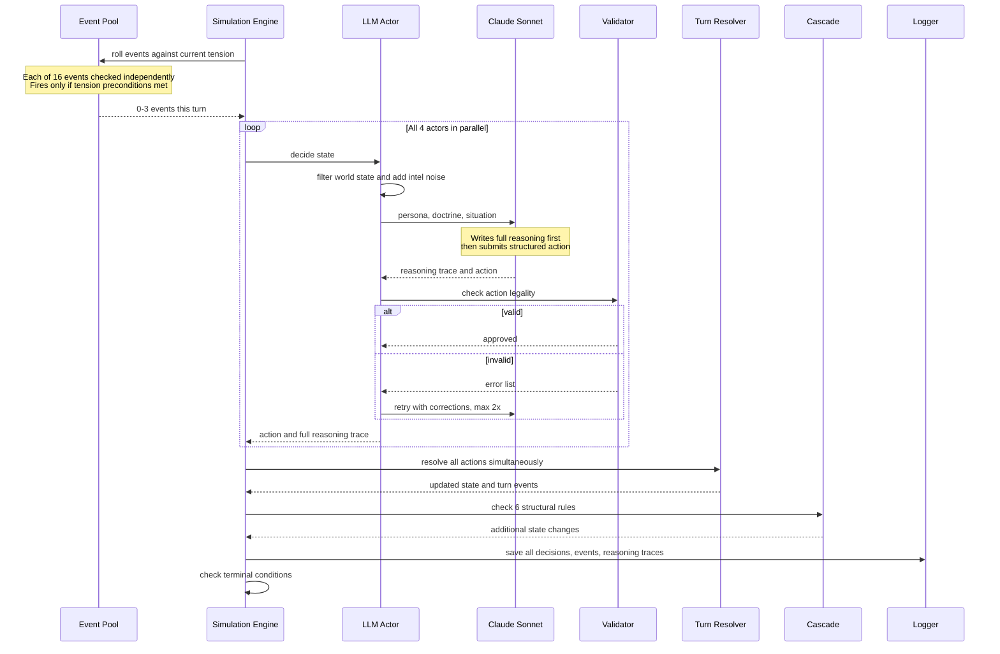
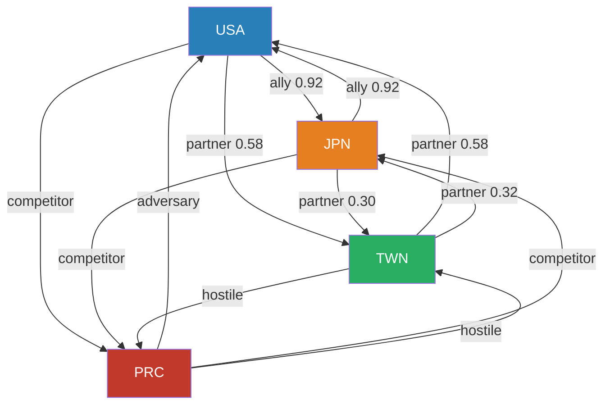
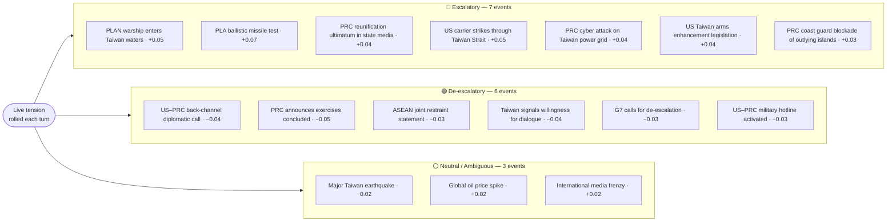
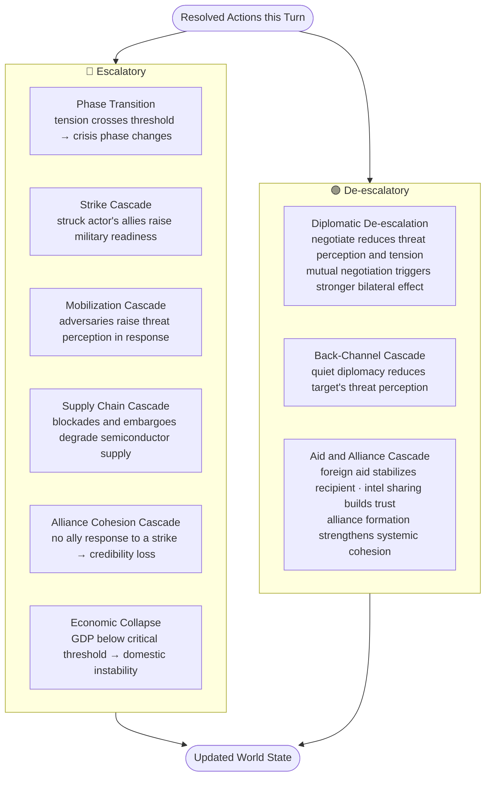

# OSE — Omni-Simulation Engine

## Purpose

OSE is a modular geopolitical conflict simulation framework where LLM agents play real-world state actors and make decisions that update a shared world state over multiple turns.

**Research thesis:** Can LLMs faithfully follow qualitative IR decision doctrines, and does doctrine assignment change behavioural outcomes in measurable ways?

This is an **interventional** experiment, not descriptive. The doctrine IS the independent variable. Every other LLM conflict simulation just observes what LLMs do. OSE prescribes how they must reason and measures compliance.

OSE is not a game. It is a **research instrument**.

---

## System Architecture

### Full Data Flow



### Module Dependency Graph



### Turn Lifecycle
```
sequenceDiagram
    participant Scenario as Event Pool
    participant Engine as Simulation Engine
    participant Agent as LLM Actor
    participant Model as Claude Sonnet
    participant Validator
    participant Resolver as Turn Resolver
    participant Cascade
    participant Logger

    Engine->>Scenario: roll events against current tension
    Note over Scenario: Each of 16 events checked independently<br/>Fires only if tension preconditions met
    Scenario-->>Engine: 0-3 events this turn

    loop All 4 agents in parallel
        Engine->>Agent: decide state
        Agent->>Agent: filter world state and add intel noise
        Agent->>Model: persona, doctrine, situation
        Note over Model: Writes full reasoning first<br/>then submits structured action
        Model-->>Agent: reasoning trace and action
        Agent->>Validator: check action legality
        alt valid
            Validator-->>Agent: approved
        else invalid
            Validator-->>Agent: error list
            Agent->>Model: retry with corrections, max 2x
        end
        Agent-->>Engine: action and full reasoning trace
    end

    Engine->>Resolver: resolve all actions simultaneously
    Resolver-->>Engine: updated state and turn events

    Engine->>Cascade: check 6 structural rules
    Cascade-->>Engine: additional state changes

    Engine->>Logger: save all decisions, events, reasoning traces
    Engine->>Engine: check terminal conditions
```

### Experiment Design



---

## File Inventory

| File | Role |
|---|---|
| `world/state.py` | WorldState, Actor (+ historical_precedents, institutional_constraints, cognitive_patterns, war_aversion fields), all resource models |
| `world/events.py` | DecisionRecord, TurnLog, GlobalEvent, RunRecord |
| `world/graph.py` | RelationshipGraph — named query wrapper over bilateral relationships |
| `actors/base.py` | ActorInterface ABC |
| `actors/persona.py` | build_persona_prompt() — 4 doctrine conditions + war_aversion injection |
| `actors/llm_actor.py` | Full LLM pipeline: perception filter → tool_choice=auto → CoT → tool_use → validate → retry |
| `actors/prompts/system.txt` | System prompt template — identity + war_aversion + historical precedents + doctrine |
| `actors/prompts/decision.txt` | Per-turn prompt — situation + 6-step rationale schema |
| `engine/actions.py` | 25 typed action classes + ACTION_REGISTRY + parser |
| `engine/validator.py` | ActionValidator — pure rule-based firewall |
| `engine/resolver.py` | Simultaneous resolution — all 25 actions, conflict adjudication |
| `engine/cascade.py` | 6 cascade rules — structural downstream effects |
| `engine/loop.py` | SimulationEngine — dynamic scenario events, full turn lifecycle + Rich display |
| `scenarios/base.py` | ScenarioDefinition ABC |
| `scenarios/taiwan_strait.py` | 4-actor Taiwan Strait 2026 — full actor profiles, 16-event stochastic pool |
| `cli/run.py` | Entry point — `python3 -m cli.run` |
| `logs/logger.py` | SQLite logger — 4 tables, full prompt + reasoning stored |
| `scoring/fidelity.py` | DoctrinesFidelityScorer — LLM-as-judge, 4 rubrics |
| `scoring/bci.py` | BCICalculator — normalized entropy across N runs, 6 action categories |
| `experiments/runner.py` | Batch orchestrator — 4×N runs, auto-score, summary JSON |
| `analysis/engine.py` | AnalysisEngine — extracts data from SQLite run DBs, computes all statistics (tension, escalation, action distributions, DFS, BCI) |
| `analysis/analyst.py` | LLMAnalyst — optional Sonnet call producing qualitative narrative (executive summary, turning points, cross-doctrine findings) |
| `analysis/renderer.py` | MarkdownRenderer + LaTeXRenderer — dual-format output matching research document style |
| `analysis/report.py` | CLI orchestrator — `python3 -m analysis.report --runs --llm --latex --output` |

---

## Action Space (25 Actions)

| Category | Count | Actions |
|---|---|---|
| Military | 8 | mobilize, strike, advance, withdraw, blockade, defensive_posture, probe, signal_resolve |
| Diplomatic | 7 | negotiate, **targeted_sanction**, **comprehensive_sanction**, form_alliance, condemn, intel_sharing, back_channel |
| Economic | 4 | embargo, foreign_aid, cut_supply, **technology_restriction** |
| Information/Cyber | 3 | propaganda, partial_coercion, **cyber_operation** |
| Nuclear | 1 | **nuclear_signal** |
| Inaction | 2 | hold_position, monitor |

**Bold** = added in v0.2. Removed: `delay_commitment`, `wait_and_observe` (redundant with hold_position), `sanction` (split into targeted/comprehensive).

Each action has: `is_valid(state) → (bool, errors)`, `get_expected_effects()`, resource cost fields.

### Doctrine-Action Discrimination

| Doctrine | Distinctive action signals |
|---|---|
| `realist` | nuclear_signal, mobilize, strike, blockade — power currency logic |
| `liberal` | negotiate, back_channel, targeted_sanction, form_alliance — interdependence preservation |
| `org_process` | defensive_posture, monitor, targeted_sanction, intel_sharing — incremental SOPs |
| `baseline` | LLM default prior (empirically expected to resemble realist) |

---

## Taiwan Strait 2026 Scenario

**Actors:** USA · PRC · TWN · JPN
**Starting phase:** `tension` | **Global tension:** `0.55`
**Relationships:** 12 directed bilateral edges

### Actor Power Summary (illustrative values)

| Actor | Conv. Forces | Naval | Air | Amphibious | A2/AD | Nuclear | Info Quality |
|---|---|---|---|---|---|---|---|
| USA | 0.85 | 0.90 | 0.88 | 0.30 | 0.52 | 0.90 | 0.82 |
| PRC | 0.82 | 0.76 | 0.72 | 0.78 | 0.82 | 0.80 | 0.75 |
| TWN | 0.50 | 0.45 | 0.55 | 0.12 | 0.68 | 0.00 | 0.70 |
| JPN | 0.62 | 0.68 | 0.64 | 0.22 | 0.58 | 0.00 | 0.76 |

### Actor Behavioral Profile Depth

All four actors have full three-field behavioral grounding injected into the system prompt:

| Field | Content |
|---|---|
| `historical_precedents` | Real crisis case studies with decision patterns and lessons (e.g. Third Taiwan Strait Crisis, Pelosi visit, Scarborough Shoal) |
| `institutional_constraints` | Actual decision machinery (NSC process, CMC structure, Article 9, Taiwan NSC) — binding procedural limits |
| `cognitive_patterns` | Documented biases (US casualty sensitivity, PRC Century of Humiliation, Taiwan abandonment anxiety, Japan entrapment-abandonment dilemma) |
| `war_aversion` | Actor-specific concrete reasons why escalation to war is catastrophic — weighted heavily in every decision |

### Relationship Graph



### Stochastic Event Pool (16 events, turns 1+)

Turn 0 has one scripted ignition event (PRC announces PLAN exercises, +0.06 tension). Every subsequent turn rolls independently from the pool.



Each event rolls independently each turn. Tension preconditions gate realism (e.g. "exercises concluded" only fires if tension ≤ 0.70).

### Terminal Conditions

- `deterrence_failure` — war phase + tension ≥ 0.90
- `deterrence_success` — tension ≤ 0.30
- `frozen_conflict` — all actors passive for 3+ consecutive turns
- `defense_success` — max turns reached, crisis/tension phase

---

## Cascade Rules



**Design note:** Cooperative cascades are intentionally weaker than escalatory ones — de-escalation is structurally harder than escalation. Mutual negotiation (both sides targeting each other in the same turn) triggers a larger effect than unilateral.

---

## Doctrine Conditions

| Condition | IR Theory | Core Prescription |
|---|---|---|
| `realist` | Waltz / Mearsheimer | Relative gains; security dilemma logic; alliances as temporary; nuclear signaling as primary deterrent |
| `liberal` | Keohane / Nye | Absolute gains; interdependence costs; multilateral legitimacy; reputation preservation |
| `org_process` | Allison Model II | SOP selection; satisficing; incremental over pivot; bureaucratic constraints binding |
| `baseline` | None | Actor identity only — empirically expected to resemble realist (LLM default prior) |

---

## Measurement Framework

### Doctrine Fidelity Score (DFS)

Scored by `claude-haiku-4-5-20251001` as judge. Judge sees only the reasoning trace — not the actor identity or the action chosen.

- `doctrine_language_score` [0–1] — uses doctrine vocabulary in reasoning
- `doctrine_logic_score` [0–1] — action follows from doctrine logic
- `doctrine_consistent_decision` [bool] — final choice is doctrine-coherent
- `contamination_flag` [bool] — uses language from a different doctrine

### Behavioral Consistency Index (BCI)

- Normalized Shannon entropy of action distribution across N repeated runs
- `0.0` = always same action (perfectly consistent — doctrine reliably channels behavior)
- `1.0` = uniform distribution (fully stochastic — doctrine has no effect)
- Computed at action level and **6-category level** (military, diplomatic, economic, information, nuclear, inaction) per actor, per condition

---

## How to Run

```bash
cd ~/Documents/OSE

# Single run — test the loop (~$0.60–0.70, ~40 API calls + reasoning traces)
python3 -m cli.run --scenario taiwan_strait --doctrine realist --turns 10

# Pilot experiment — 4 conditions × 5 runs (~$12–14)
python3 -m experiments.runner --runs 5 --turns 10

# Full research experiment — 4 conditions × 20 runs (~$50–60)
python3 -m experiments.runner --runs 20 --turns 15

# Query reasoning traces from any run
sqlite3 logs/runs/<run_id>.db \
  "SELECT actor_short_name, turn, length(reasoning_trace), substr(reasoning_trace,1,300) FROM decisions ORDER BY turn, actor_short_name LIMIT 20;"

# Query action distribution
sqlite3 logs/runs/<run_id>.db \
  "SELECT actor_short_name, parsed_action, COUNT(*) FROM decisions GROUP BY actor_short_name, parsed_action ORDER BY actor_short_name, COUNT(*) DESC;"

# Generate analysis report (statistical only)
python3 -m analysis.report --runs logs/runs/ --output reports/

# With LLM qualitative analysis + LaTeX PDF
python3 -m analysis.report --runs logs/runs/ --llm --latex --output reports/
```

---

## Stack

| Component | Choice | Why |
|---|---|---|
| Language | Python 3.11+ | Pydantic v2, Anthropic SDK |
| Schema | Pydantic v2 | Strict typing, [0,1] float enforcement |
| LLM (decisions) | `claude-sonnet-4-6` | Best reasoning/cost at simulation scale |
| LLM (scoring) | `claude-haiku-4-5-20251001` | Cost-efficient bulk fidelity scoring |
| Structured output | Anthropic `tool_use` with `tool_choice=auto` | CoT reasoning first, then guaranteed JSON schema action |
| Logging | SQLite (stdlib) | No deps, full replay, queryable |
| CLI display | Rich | Turn-by-turn terminal output |
| LLM (analysis) | `claude-sonnet-4-6` | Qualitative narrative requires cross-doctrine comparative reasoning |
| Reports | Markdown + LaTeX (booktabs/fancyhdr/natbib) | Matches existing research document style |
| Dependency mgmt | `uv` + `pyproject.toml` | Fast, modern |

---

## Build Status

| Phase | Deliverable | Status |
|---|---|---|
| 1 | World state models + action space | ✅ Done |
| 2 | Actor + LLM loop | ✅ Done |
| 3 | Simulation engine + logger | ✅ Done |
| 4 | Taiwan Strait scenario + CLI | ✅ Done |
| 5 | Scoring layer (DFS + BCI) + experiment runner | ✅ Done |
| 5b | v0.2 improvements (action space, stochastic events, reasoning traces, actor profiles) | ✅ Done |
| 6 | Run pilot experiment (4×5) | ⬜ Next |
| 7 | Analysis engine (engine + LLM analyst + Markdown/LaTeX renderer + CLI) | ✅ Done |
| 8 | Research write-up | ⬜ Pending |

---

## Known Limitations (for methods section)

- **No causal identification**: OSE measures behavioral correlates of doctrine assignment, not causal doctrine→action chains. Reasoning traces may be post-hoc rationalization.
- **DFS circularity**: Doctrine rubrics and doctrine instructions share vocabulary — measure may capture prompt compliance, not genuine reasoning change.
- **Cascade asymmetry (partially resolved)**: Three de-escalatory cascade rules added (Rules 7–9) for negotiate, back_channel, foreign_aid, intel_sharing, form_alliance. Escalatory effects are still structurally stronger — de-escalation requires sustained cooperation, not a single action.
- **Single scenario**: All findings are Taiwan Strait-specific. Generalizability requires a second scenario.
- **Baseline confound**: Baseline condition reflects LLM default prior (likely realist-adjacent), not a clean null.
- **Haiku judge**: Secondary LLM is weaker than the decision LLM; complex reasoning distinctions may be mis-scored.

---

## Open Questions

- Add a second scenario (Ukraine, South China Sea) to test generalizability?
- Manual annotation sample: have IR scholar score 20–30 traces to validate Haiku judge (r ≥ 0.70 target)?
- Should cascade rules gain de-escalatory effects for cooperative actions?
- Scoring: should the judge LLM also see the action chosen, or only the reasoning trace?
- Should actors be shown outcome classifications from prior runs to build trajectory awareness?

---

## Decision Log

| Date | Decision | Rationale |
|---|---|---|
| 2026-03-26 | LLMs as behavior engine (hybrid CoT + structured output) | More realistic than utility-function agents; human irrationality is load-bearing |
| 2026-03-26 | Conflict as first domain | Highest decision value; most demanding test of emergence |
| 2026-03-26 | Taiwan Strait as first scenario | Well-documented motivations, clear asymmetries, rich cascade potential |
| 2026-03-26 | CLI-first, no UI | Core loop correctness before interface |
| 2026-03-26 | temperature=0 for structured outputs | Reproducibility via full prompt logging |
| 2026-03-26 | Doctrine vs. persona design | Doctrine is experimentally controllable; persona conflates identity with reasoning |
| 2026-03-26 | Qualitative bands (HIGH/MEDIUM/LOW) not raw floats | Prevents numerical hallucination; matches how real decision-makers reason |
| 2026-03-26 | Simultaneous turn resolution | Eliminates turn-order bias; forces genuine uncertainty into actor calculus |
| 2026-03-27 | 23 action classes (expanded from 17) | Added probe, signal_resolve, back_channel, partial_coercion, 4 inaction types |
| 2026-03-27 | Haiku for fidelity scoring | Cost-efficient for bulk secondary LLM calls; reasoning quality sufficient for rubric scoring |
| 2026-03-27 | tool_choice="any" → "auto" | "any" suppressed text reasoning; actors produced empty reasoning traces defeating DFS scoring |
| 2026-03-27 | Scripted events → stochastic pool | Deterministic turn-3 event (+0.08) guaranteed crisis threshold crossing regardless of actor behavior; pool creates genuine run-to-run variance for BCI |
| 2026-03-27 | Dynamic scenario event generation | Pre-computed events used initial state for all condition checks; now rolls against live tension each turn |
| 2026-03-27 | 25 action classes (restructured from 23) | Added cyber_operation, technology_restriction, nuclear_signal; split sanction into targeted/comprehensive; removed redundant delay_commitment and wait_and_observe |
| 2026-03-27 | war_aversion field in actor profiles | Actors had no awareness that war is catastrophically bad for them; locally-rational decisions produced deterministic escalation |
| 2026-03-27 | Full actor behavioral profiles | historical_precedents + institutional_constraints + cognitive_patterns grounds LLM behavior in real-world decision patterns |
| 2026-03-27 | Analysis engine: hybrid stats + optional LLM | Pure Python deterministic stats (engine.py) + optional Sonnet qualitative layer (analyst.py); inflection-point trace sampling keeps LLM context manageable; dual Markdown/LaTeX output |
| 2026-03-27 | Inflection-point sampling for LLM analysis | Feeding all traces would blow context; instead sample max 6/run: first active action per actor, phase transitions, contamination flags — high signal density |

---
