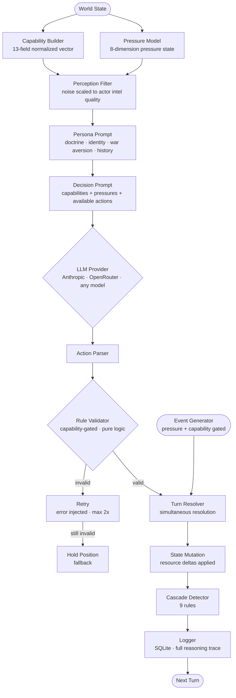
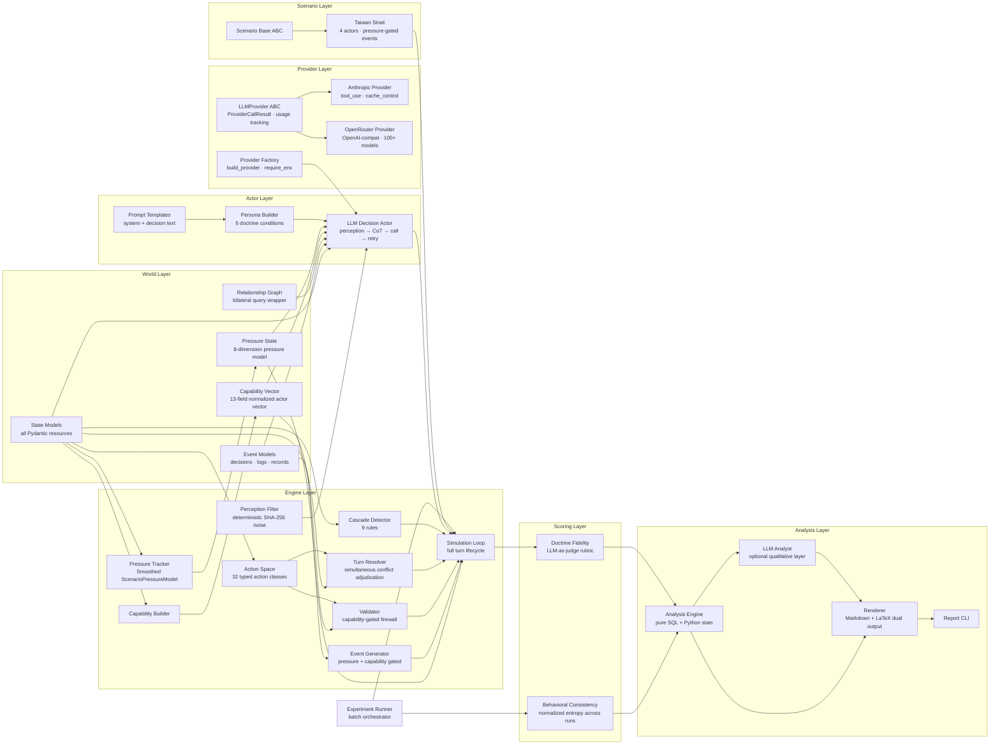
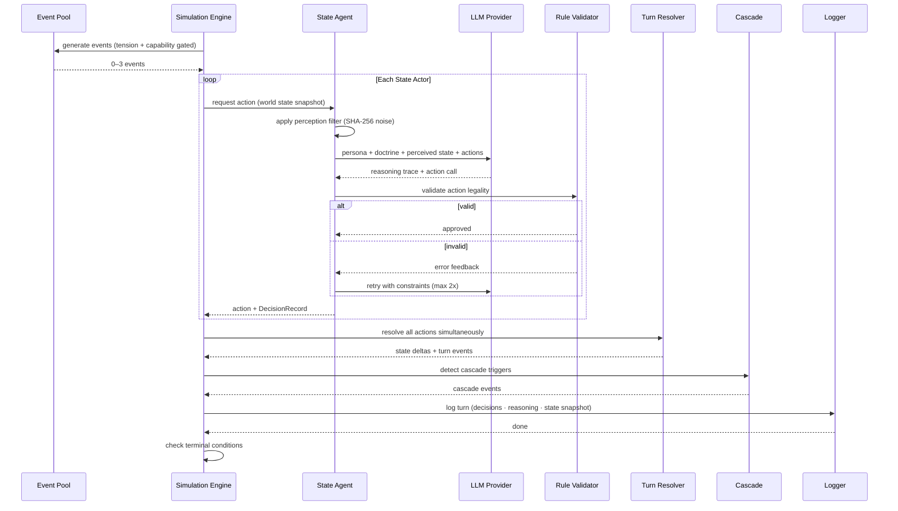

# OSE — Omni-Simulation Engine

**Status:** Active | **Version:** v0.4

LLM-driven geopolitical conflict simulation. State actors powered by real IR decision doctrines. Outcomes emerge from LLM reasoning, not scripted rules.

**Research thesis:** Does doctrine assignment change measurable behavioural outcomes across LLMs? OSE prescribes how agents must reason and measures compliance — it is an interventional experiment, not a sandbox.

---

## Quick Start

```bash
# Install
uv pip install -e ".[dev]"
cp .env.example .env   # add keys

# Run with Anthropic (default provider/model)
ose realist --turns 15

# Run with OpenRouter
ose liberal openai/gpt-5.4 --turns 15

# Run a batch for one provider/model
python -m experiments.runner \
  --scenario taiwan_strait \
  --conditions realist liberal constructivist baseline \
  --provider openrouter \
  --model openai/gpt-5.4 \
  --turns 15 \
  --runs 3 \
  --skip-scoring \
  --skip-bci

# Generate report
ose reports --runs logs/runs --output reports/
```

---

## Data Flow



---

## Module Graph



## Turn Lifecycle



---

## Doctrine Conditions

Six doctrine conditions control how actors reason. Assigned per run; the LLM must follow the framework explicitly.

| Condition | IR Theory | Core Logic |
|---|---|---|
| `realist` | Structural Realism (Waltz/Mearsheimer) | Relative power maximization. Survival first. Balance threats. |
| `liberal` | Liberal Institutionalism (Keohane) | Cooperation pays. Institutions and reputation constrain behaviour. |
| `org_process` | Organizational Process (Allison II) | Organizational routines constrain choices. SOPs and satisficing dominate. |
| `constructivist` | Constructivism (Wendt) | Identity and norms drive action. Audience costs are real. |
| `marxist` | Marxist / Radical IR | Dependency, hierarchy, and capital autonomy frame the decision. |
| `baseline` | Rational Actor Model (Allison I) | Maximize expected utility. Explicit cost/benefit per action. |

---

## Action Space (32 actions)

| Category | Actions |
|---|---|
| Military | `mobilize` `strike` `advance` `withdraw` `blockade` `defensive_posture` `probe` `signal_resolve` `deploy_forward` |
| Diplomatic / Legal | `negotiate` `targeted_sanction` `comprehensive_sanction` `form_alliance` `condemn` `intel_sharing` `back_channel` `lawfare_filing` `multilateral_appeal` `expel_diplomats` |
| Economic | `embargo` `foreign_aid` `cut_supply` `technology_restriction` `asset_freeze` `supply_chain_diversion` |
| Information / Cyber | `propaganda` `partial_coercion` `cyber_operation` `hack_and_leak` |
| Nuclear | `nuclear_signal` |
| Standby | `hold_position` `monitor` |

---

## Capability System

Each actor gets a 13-field capability vector derived from `WorldState` each turn. The LLM sees qualitative bands (HIGH / MEDIUM / LOW), never raw floats.

Fields: `local_naval_projection` · `local_air_projection` · `missile_a2ad_capability` · `cyber_capability` · `intelligence_quality` · `economic_coercion_capacity` · `alliance_leverage` · `logistics_endurance` · `domestic_stability` · `war_aversion` · `escalation_tolerance` · `bureaucratic_flexibility` · `signaling_credibility`

---

## Pressure System

Eight pressure dimensions track crisis dynamics independently of resource values.

Dimensions: `military_pressure` · `diplomatic_pressure` · `alliance_pressure` · `domestic_pressure` · `economic_pressure` · `informational_pressure` · `crisis_instability` · `uncertainty`

---

## Taiwan Strait Scenario

Four actors. Starting phase: `tension`. Global tension: 0.55.

| Actor | Conv. Forces | Naval | Air | Econ | Stability |
|---|---|---|---|---|---|
| USA | 0.85 | 0.90 | 0.88 | 0.80 | 0.70 |
| PRC | 0.82 | 0.75 | 0.70 | 0.75 | 0.65 |
| TWN | 0.50 | 0.45 | 0.55 | 0.70 | 0.72 |
| JPN | 0.60 | 0.65 | 0.62 | 0.72 | 0.68 |

Values are illustrative research constructs, not real intelligence estimates.

---

## Cascade Rules

Automatic state mutations triggered after turn resolution.

| # | Trigger | Effect |
|---|---|---|
| 1 | Actor mobilizes | Adversary readiness +0.10 |
| 2 | Strike executed | Target conventional_forces −0.15, attacker readiness −0.05 |
| 3 | Advance into contested zone | global_tension +0.10, target defensive_posture likelihood↑ |
| 4 | Blockade active | Target economic −0.08/turn, global shipping disruption +0.05 |
| 5 | Nuclear signaling | global_tension +0.20, all actors readiness +0.15 |
| 6 | Alliance formed | Third-party threat perception shifts, tension adjusts |
| 7 | Negotiation accepted | global_tension −0.10 |
| 8 | Ceasefire accepted | crisis_phase → `post_conflict`, all readiness −0.20 |
| 9 | War termination | Final state snapshot, run ends |

---

## Measurement

**Doctrine Fidelity Score (DFS):** LLM-as-judge rubric. Each reasoning trace scored on 5 axes against the assigned doctrine. Scale 0–1.

**Behavioral Consistency Index (BCI):** Normalized entropy of action distributions across repeated runs of the same condition. Low BCI = high variance (doctrine not binding). High BCI = consistent behaviour.

---

## Running Experiments

```bash
# Single run
ose realist --turns 15 --log-dir logs/runs/

# Compare doctrines for one provider/model
python -m experiments.runner \
  --scenario taiwan_strait \
  --conditions realist liberal constructivist baseline \
  --provider openrouter \
  --model openai/gpt-5.4 \
  --turns 15 \
  --runs 3

# Query run log
sqlite3 logs/runs/<run_id>.db "SELECT turn, actor_short_name, json_extract(parsed_action, '$.action_type') AS action_type, validation_result FROM decisions ORDER BY turn, actor_short_name;"

# Generate analysis report
python -m analysis --runs logs/runs --output reports/

# Generate analysis report with Opus-backed narrative and LaTeX
python -m analysis --runs logs/runs --llm --latex --output reports/
```

Analytics and DFS scoring use the Anthropic API directly. To override the judge /
analyst models, set one or more of:

```bash
OSE_ANALYTICS_MODEL=claude-opus-4-6
OSE_SCORER_MODEL=claude-opus-4-6
OSE_ANALYST_MODEL=claude-opus-4-6
```

Anthropic's direct API uses Claude-native model IDs like `claude-opus-4-6`,
not OpenRouter-style names like `anthropic/claude-opus-4.6`.

---

## Stack

| Component | Choice |
|---|---|
| Language | Python 3.11+ |
| Schema | Pydantic v2 |
| LLM (default) | `claude-sonnet-4-6` via Anthropic tool_use |
| Multi-provider | OpenRouter (OpenAI-compat) — 100+ models |
| Structured output | Tool/function calling — schema-enforced JSON |
| Logging | SQLite (stdlib) |
| CLI display | Rich |
| Dependency mgmt | `uv` + `pyproject.toml` |

---

## File Map

```
ose/
├── world/
│   ├── state.py          # WorldState · Actor · all Pydantic resource models
│   ├── events.py         # DecisionRecord · TurnLog · RunRecord
│   ├── graph.py          # RelationshipGraph bilateral query wrapper
│   ├── capabilities.py   # build_actor_capabilities() → 13-field vector
│   └── pressures.py      # PressureState · contribution traces · banded view
│
├── providers/
│   ├── base.py           # LLMProvider ABC · ProviderCallResult dataclass
│   ├── anthropic_provider.py   # tool_use · input_schema · cache tokens
│   ├── openrouter_provider.py  # OpenAI-compat · tool / JSON compatibility fallbacks
│   └── factory.py        # build_provider() · require_provider_env()
│
├── actors/
│   ├── llm_actor.py      # Perception → CoT → provider.call() → retry → DecisionRecord
│   ├── persona.py        # build_persona_prompt() · 6 doctrine conditions
│   └── prompts/
│       ├── system.txt    # Actor identity · Simulation Research Contract
│       └── decision.txt  # Per-turn decision request · compliance anchor
│
├── engine/
│   ├── actions.py        # 32 typed action classes · ACTION_REGISTRY
│   ├── validator.py      # Capability-gated rule validator · pure logic
│   ├── resolver.py       # Simultaneous turn resolution · conflict adjudication
│   ├── cascade.py        # 9 cascade rules · escalatory + de-escalatory
│   ├── costs.py          # Per-action resource depletion
│   ├── perception.py     # Deterministic SHA-256 noise filter
│   ├── event_generation.py # Pressure + capability gated event generator
│   └── loop.py           # SimulationEngine · full turn lifecycle
│
├── scenarios/
│   ├── base.py           # ScenarioDefinition ABC
│   └── taiwan_strait.py  # 4-actor Taiwan Strait · pressure-gated event templates
│
├── scoring/
│   ├── fidelity.py       # Doctrine Fidelity Score · LLM-as-judge
│   └── bci.py            # Behavioral Consistency Index · entropy
│
├── experiments/
│   └── runner.py         # Batch orchestrator · multi-condition × repeated runs
│
├── analysis/
│   ├── engine.py         # Pure SQL + Python statistics
│   ├── analyst.py        # Optional Anthropic qualitative layer (configurable)
│   ├── graphs.py         # SVG graph asset generation
│   ├── renderer.py       # Markdown + LaTeX dual output
│   └── report.py         # CLI entry point
│
├── cli/
│   ├── ose.py            # Friendly launcher: run / batch / reports aliases
│   └── run.py            # Entry point · --provider · --model · --doctrine flags
│
└── logs/
    └── logger.py         # SQLite-backed structured logger · full replay
```

---

## Known Limitations

- Non-determinism: even at temperature=0, OpenRouter models may vary between calls. BCI is designed to measure this.
- Action category mapping: new actions added in v0.4 must be manually added to the analysis engine's category map or they appear as `unknown`.
- No web UI. Terminal output via Rich only.
- Scenario pool is single-domain (Taiwan Strait). Framework is scenario-agnostic; adding scenarios requires implementing `ScenarioDefinition`.
- Replay fidelity: full prompt logging enables replay, but provider-side updates can change outputs over time.
