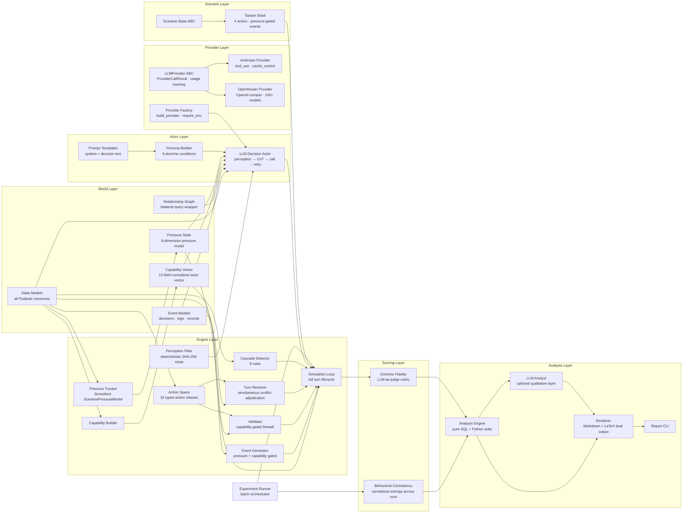
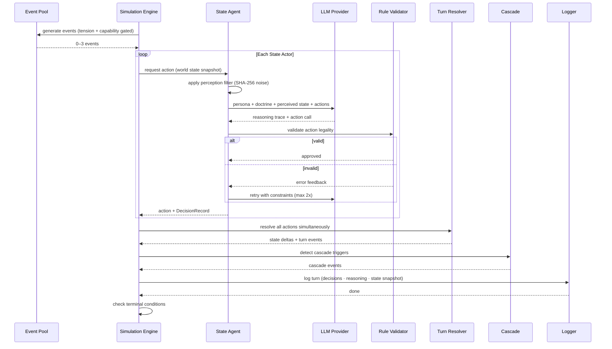

# OSE — Omni-Simulation Engine

**Status:** Active | **Version:** v0.1.0

**UNDER WORK AS OF 30th Of March 2026**

OSE is an LLM-driven geopolitical crisis simulation framework. Each actor is assigned an IR doctrine, chooses one action per turn from a constrained action menu, and the engine resolves all actions simultaneously against a bounded world state.

**Research thesis:** if you force the same model to reason through different doctrines, do you get measurably different crisis behavior?

## What OSE Does

- Runs a bounded multi-actor crisis simulation rather than open-ended roleplay.
- Assigns each run one doctrine condition: `realist`, `liberal`, `org_process`, `constructivist`, `marxist`, or `baseline`.
- Logs every decision, rationale, state snapshot, and outcome to SQLite.
- Generates Markdown / JSON / LaTeX reports from run logs.
- Supports Anthropic directly and OpenRouter for broad model coverage.

## Canonical Interface

Examples below use `python3 ose` from the repo root, which is the workflow this repo is built around.

After editable install, `ose` works the same way.

## Install

```bash
uv pip install -e ".[dev]"
cp .env.example .env
```

Add at least one provider key to `.env`:

- `ANTHROPIC_API_KEY` for Anthropic decision runs and LLM analytics
- `OPENROUTER_API_KEY` for OpenRouter models

## Quick Start

OSE is model-agnostic. Any model string is a drop-in — Anthropic natively, or any of the 200+ models on OpenRouter. The launcher infers the provider automatically from the model string: a `/` means OpenRouter, no `/` means Anthropic.

### Single Run

Anthropic (default model):

```bash
python3 ose realist --turns 10
```

Anthropic (specific model):

```bash
python3 ose realist claude-opus-4-6 --turns 10
```

OpenRouter — GPT-4o:

```bash
python3 ose liberal openai/gpt-4o --turns 10 --seed 0
```

OpenRouter — Gemini:

```bash
python3 ose constructivist google/gemini-2.5-pro-preview --turns 10 --seed 0
```

OpenRouter — Llama:

```bash
python3 ose baseline meta-llama/llama-3.1-405b-instruct --turns 10 --seed 0
```

OpenRouter — DeepSeek:

```bash
python3 ose realist deepseek/deepseek-r1 --turns 10 --seed 0
```

You can pass any OpenRouter model ID directly. If the model has known tool-call limitations, OSE routes it automatically to the correct fallback strategy (see [OpenRouter Compatibility](#openrouter-compatibility)).

### Generate Reports

Basic report:

```bash
python3 ose reports --runs logs/runs --output reports/
```

Report with LLM narrative and LaTeX:

```bash
python3 ose reports --runs logs/runs --llm --latex --output reports/
```

### Batch Runs

```bash
python3 ose batch \
  --scenario taiwan_strait \
  --provider openrouter \
  --model openai/gpt-4o \
  --conditions realist liberal constructivist baseline \
  --runs 3 \
  --turns 12 \
  --skip-scoring \
  --skip-bci
```

## Data Flow


## Module Graph



## Turn Lifecycle



## Launcher Rules

The top-level launcher is intentionally simple:

- `python3 ose <doctrine> [model] --turns N`
- `python3 ose reports ...`
- `python3 ose batch ...`

**Provider inference — you never have to type `--provider`:**

| Model string | Inferred provider |
|---|---|
| Contains `/` (e.g. `openai/gpt-4o`) | `openrouter` |
| No `/` (e.g. `claude-sonnet-4-6`) | `anthropic` |

You can always override explicitly with `--provider anthropic` or `--provider openrouter`.

**Model string is pass-through.** Any model ID that OpenRouter supports works unchanged:

```bash
# Anthropic native
python3 ose realist claude-sonnet-4-6 --turns 10
python3 ose realist claude-opus-4-6 --turns 10

# OpenAI via OpenRouter
python3 ose liberal openai/gpt-4o --turns 10
python3 ose liberal openai/gpt-4o-mini --turns 10

# Google via OpenRouter
python3 ose constructivist google/gemini-2.5-pro-preview --turns 10
python3 ose constructivist google/gemini-2.0-flash-001 --turns 10

# Meta via OpenRouter
python3 ose baseline meta-llama/llama-3.1-405b-instruct --turns 10

# DeepSeek via OpenRouter
python3 ose marxist deepseek/deepseek-r1 --turns 10

# xAI via OpenRouter
python3 ose baseline x-ai/grok-3-beta --turns 10

# Mistral via OpenRouter
python3 ose org_process mistralai/mistral-large --turns 10
```

## OpenRouter Compatibility

OSE handles tool-call variation across models automatically using a three-tier fallback:

1. **forced_tool_choice** — preferred; forces the model to emit a structured function call
2. **auto_tools** — provides the tool schema but lets the model decide how to call it
3. **json_content** — plain JSON output with no tool schema; used when tool calling is unavailable

Models known to lack tool support are pre-mapped and skip straight to `json_content` without wasting API calls on failed attempts. Unknown models are assumed to support `forced_tool_choice` and fall back gracefully on error.

If a model produces an unparseable response after all fallbacks, OSE retries up to 2 times, then falls back to `hold_position` for that actor on that turn.

## Doctrine Conditions

Each run uses one doctrine condition across all actors.

| Condition | IR Theory | Core Logic |
|---|---|---|
| `realist` | Structural Realism | Relative gains, survival, threat balancing, distrust of restraint |
| `liberal` | Liberal Institutionalism | Absolute gains, interdependence, institutions, reputation |
| `org_process` | Organizational Process | SOPs, bureaucratic inertia, satisficing, constrained menus |
| `constructivist` | Constructivism | Identity, legitimacy, norms, signaling, role behavior |
| `marxist` | Marxist / Radical IR | Dependency, hierarchy, capital autonomy, anti-hegemonic leverage |
| `baseline` | Rational Actor Model | Explicit expected utility, cost-benefit optimization |

## Action Space

OSE currently exposes `32` engine-validated actions.

| Category | Actions |
|---|---|
| Military | `mobilize` `strike` `advance` `withdraw` `blockade` `defensive_posture` `probe` `signal_resolve` `deploy_forward` |
| Diplomatic / Legal | `negotiate` `targeted_sanction` `comprehensive_sanction` `form_alliance` `condemn` `intel_sharing` `back_channel` `lawfare_filing` `multilateral_appeal` `expel_diplomats` |
| Economic | `embargo` `foreign_aid` `cut_supply` `technology_restriction` `asset_freeze` `supply_chain_diversion` |
| Information / Cyber | `propaganda` `partial_coercion` `cyber_operation` `hack_and_leak` |
| Nuclear | `nuclear_signal` |
| Standby | `hold_position` `monitor` |

The validator is rule-based. If a model produces an illegal or incompatible action, OSE retries and ultimately falls back to `hold_position` if necessary.

## Scenario Model

Current primary scenario:

- `taiwan_strait`

Default setting:

- 4 actors: `USA`, `PRC`, `TWN`, `JPN`
- initial phase: `tension`
- initial global tension: `0.55`
- open-ended pressure-gated event generation

OSE is bounded, not freeform:

- action menus are constrained
- capabilities are explicit
- event templates are authored and eligibility-gated
- world state transitions are engine-resolved

## Capability and Pressure Layers

Each actor gets a 14-field capability vector, shown to the model as qualitative bands:

`local_naval_projection`, `local_air_projection`, `missile_a2ad_capability`, `cyber_capability`, `intelligence_quality`, `economic_coercion_capacity`, `alliance_leverage`, `logistics_endurance`, `domestic_stability`, `war_aversion`, `escalation_tolerance`, `bureaucratic_flexibility`, `signaling_credibility`, `theater_access`

Each turn also computes an 8-field pressure state:

`military_pressure`, `diplomatic_pressure`, `alliance_pressure`, `domestic_pressure`, `economic_pressure`, `informational_pressure`, `crisis_instability`, `uncertainty`

These drive:

- prompt shaping
- event eligibility
- action feasibility and downstream costs
- later analysis and comparison

## Outputs

### Run Logs

Single runs write SQLite logs to:

```text
logs/runs/<run_id>.db
```

Batch runs write per-experiment directories under:

```text
logs/experiments/<experiment_id>/
```

### Reports

Reports write to:

```text
reports/
```

Typical outputs:

- `*.md`
- `*.json`
- `*.tex` when `--latex` is enabled
- graph assets in a sibling `*_assets/` directory

## Useful Commands

Query actions from a run:

```bash
sqlite3 logs/runs/<run_id>.db \
  "SELECT turn, actor_short_name, json_extract(parsed_action, '$.action_type') AS action_type, validation_result FROM decisions ORDER BY turn, actor_short_name;"
```

Show available launcher modes:

```bash
python3 ose --help
python3 ose batch --help
python3 ose reports --help
```

## Analytics

OSE supports two main post-run measures:

- **Doctrine Fidelity Score (DFS)**: LLM-as-judge scoring of reasoning traces against the assigned doctrine
- **Behavioral Consistency Index (BCI)**: entropy-style consistency metric across repeated same-condition runs

Important note:

- BCI only makes sense when you have repeated runs for the same configuration
- single-run sweeps should be treated as qualitative / pilot comparisons, not BCI studies

### Anthropic Analytics Overrides

Analytics and DFS scoring use the Anthropic API directly.

You can override the analyst / scorer models with:

```bash
OSE_ANALYTICS_MODEL=claude-opus-4-6
OSE_SCORER_MODEL=claude-opus-4-6
OSE_ANALYST_MODEL=claude-opus-4-6
```

These use Anthropic-native model IDs, not OpenRouter-style names.

## Environment Defaults

The repo exposes a few runtime defaults through `.env`:

```bash
OSE_LOG_DIR=logs/runs
OSE_DEFAULT_TURNS=15
OSE_DEFAULT_TEMPERATURE=0
OSE_SCENARIO_SEED=0
```

Prompt verbosity — controls how much actor backstory is injected per call:

```bash
# full (default) ~3000 tokens — best fidelity for final research runs
# compact        ~1500 tokens — trimmed backstory, no history — good for bulk runs
# minimal        ~800 tokens  — goals + red lines + doctrine only
OSE_PROMPT_MODE=compact
```

OpenRouter output token limits:

```bash
OSE_OPENROUTER_MAX_TOKENS=768       # default per-call output limit
OSE_OPENROUTER_JSON_MAX_TOKENS=256  # limit for json_content fallback calls
```

## Installed Scripts

After `uv pip install -e ".[dev]"`, four scripts are available system-wide:

| Script | Equivalent | Purpose |
|---|---|---|
| `ose` | `python3 ose` | Main launcher (run / batch / reports) |
| `ose-run` | `python -m cli.run` | Direct single-run CLI |
| `ose-report` | `python -m analysis.report` | Report generator |
| `ose-analyze` | `python -m analysis` | Analysis entrypoint |

## Advanced / Internal Entry Points

If you want to bypass the `ose` launcher, the module entry points still work:

```bash
python -m cli.run --help
python -m experiments.runner --help
python -m analysis.report --help
```

The launcher is the recommended public interface. The module entry points are lower-level.

## Repository Layout

```text
world/         core state, events, graph, capabilities, pressures
actors/        personas, prompts, LLM actor pipeline
engine/        actions, validator, resolver, loop, event generation
scenarios/     scenario definitions and event templates
providers/     Anthropic + OpenRouter adapters
experiments/   repeated-run batch orchestration
scoring/       DFS and BCI
analysis/      report extraction, graphs, rendering, LLM analysis
logs/          SQLite logger
cli/           launcher and lower-level CLIs
```

## Known Limitations

- OSE is model-agnostic, but output quality varies. Models that ignore the action schema or produce freeform text will fall back to `hold_position` after retries — visible in logs as `validation_result: fallback`.
- Even at `temperature=0`, provider-side nondeterminism can still appear (especially on OpenRouter where routing may shift between requests).
- The current benchmark is the Taiwan Strait scenario; the framework is extensible but still scenario-light.
- BCI is only meaningful for repeated same-model runs, not one-off model sweeps.
- Provider-side model updates can change outputs over time, even with identical prompts and seeds.
