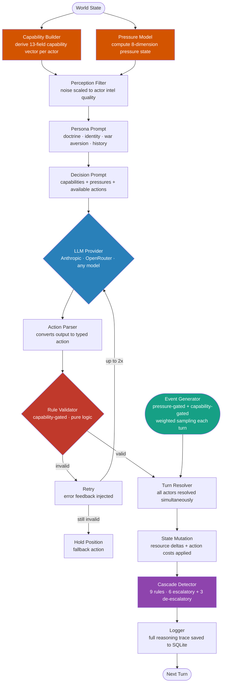
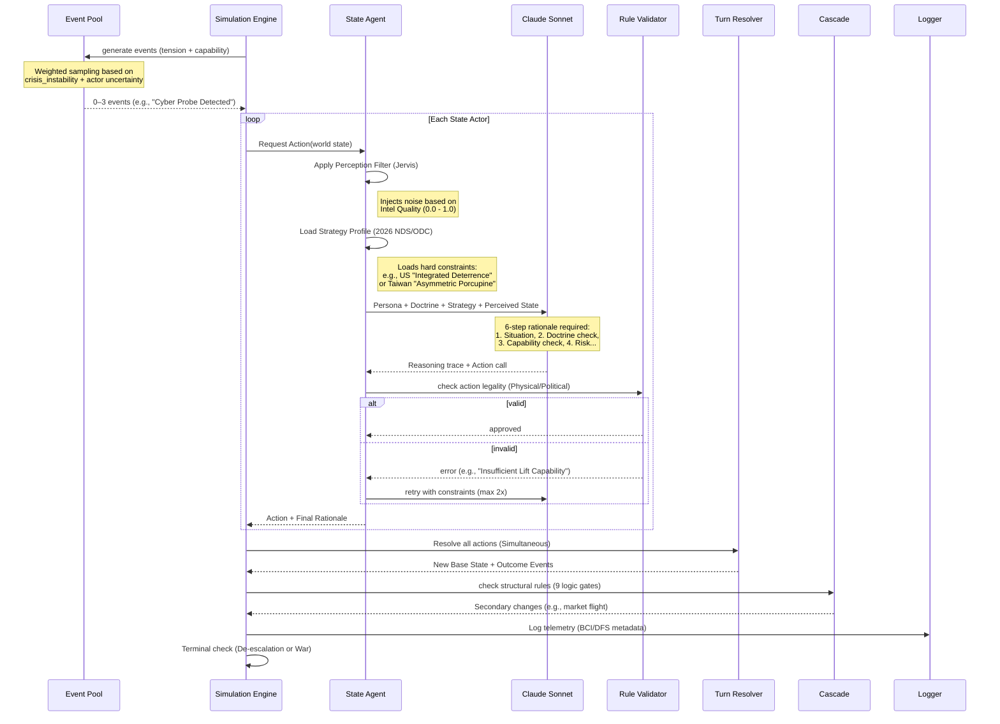
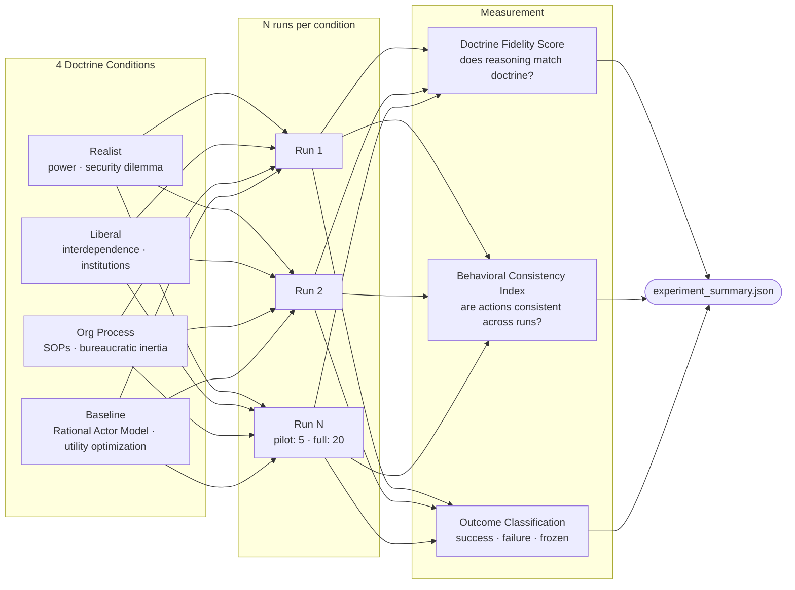
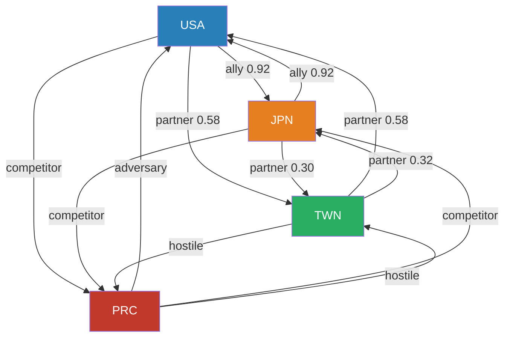
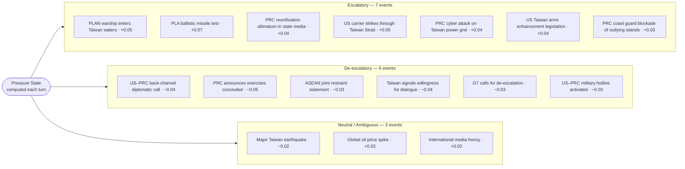
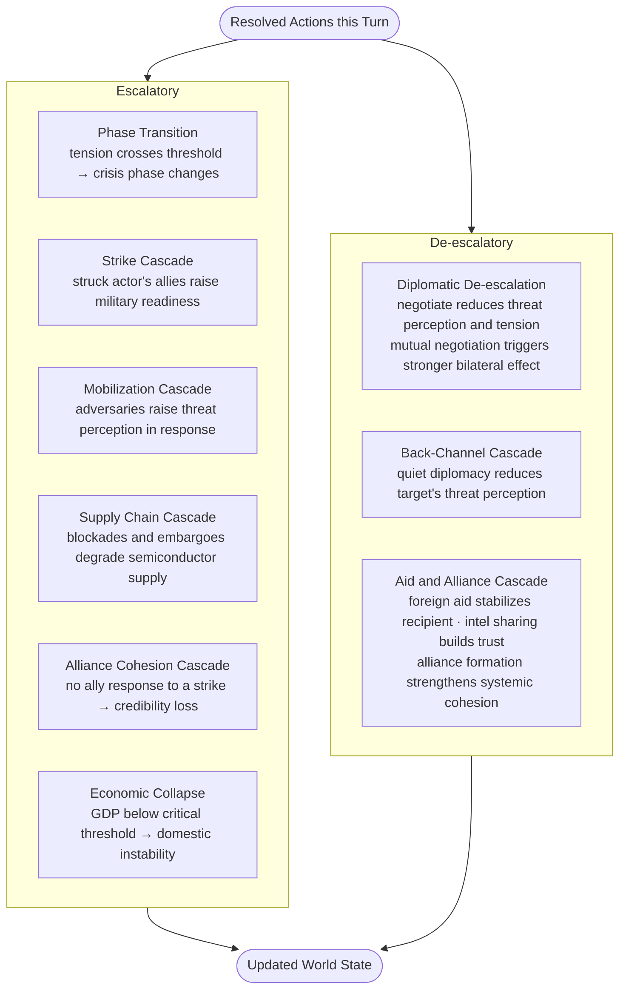

# OSE — Omni-Simulation Engine

**Status:** Active
**Started:** 2026-03-26
**Build status:** v0.4 — multi-provider LLM backend · Rational Actor Model baseline · cross-model comparison ready
**Repo:** `~/Documents/OSE/`

---

## Purpose

OSE is a modular geopolitical conflict simulation framework where LLM agents play real-world state actors and make decisions that update a shared world state over multiple turns.

**Research thesis:** Can LLMs faithfully follow qualitative IR decision doctrines, and does doctrine assignment change behavioural outcomes in measurable ways?

This is an **interventional** experiment, not descriptive. The doctrine IS the independent variable. Every other LLM conflict simulation just observes what LLMs do. OSE prescribes how they must reason and measures compliance.

OSE is not a game. It is a **research instrument**.

---

## System Architecture

### Full Data Flow



### Module Dependency Graph

```mermaid
graph LR
    subgraph World["World Layer"]
        State[State Models\nall Pydantic resources]
        Events[Event Models\ndecisions · logs · records]
        RelGraph[Relationship Graph\nbilateral query wrapper]
        WCap[Capability Vector\n13-field normalized actor vector]
        WPres[Pressure State\n8-dimension pressure model]
    end

    subgraph Providers["Provider Layer"]
        ProvBase[LLMProvider ABC\nProviderCallResult · usage tracking]
        ProvAnthropic[Anthropic Provider\ntool_use · cache_control · input/output tokens]
        ProvOpenRouter[OpenRouter Provider\nOpenAI-compat · function calling · 100+ models]
        ProvFactory[Provider Factory\nbuild_provider() · require_provider_env()]
    end

    subgraph Actors["Actor Layer"]
        Prompts[Prompt Templates\nsystem + decision text]
        Persona[Persona Builder\n4 doctrine conditions + RAM baseline]
        LLMActor[LLM Decision Actor\nperception → CoT → provider.call() → retry]
    end

    subgraph Engine["Engine Layer"]
        Actions[Action Space\n25 typed action classes]
        Validator[Validator\ncapability-gated firewall]
        Resolver[Turn Resolver\nsimultaneous conflict adjudication]
        Cascade[Cascade Detector\n9 rules · escalatory + de-escalatory]
        Loop[Simulation Loop\nfull turn lifecycle]
        ECap[Capability Builder\nbuild_actor_capabilities per turn]
        EPres[Pressure Tracker\nScenarioPressureModel · smoothed]
        Perception[Perception Filter\ndeterministic SHA-256 noise]
        Costs[Action Costs\nper-action resource depletion]
        EventGen[Event Generator\npressure + capability gated]
        ScenTemplate[Scenario Template\nOpenEndedScenarioTemplate ABC]
    end

    subgraph Scenarios["Scenario Layer"]
        ScenarioBase[Scenario Base\nABC interface]
        Taiwan[Taiwan Strait\n4 actors · pressure-gated event pool]
    end

    subgraph Scoring["Scoring Layer"]
        Fidelity[Doctrine Fidelity\nLLM-as-judge rubric]
        BCI[Behavioral Consistency\nnormalized entropy across runs]
    end

    Runner[Experiment Runner\nbatch orchestrator]

    subgraph Analysis["Analysis Layer"]
        AEngine[Analysis Engine\npure SQL+Python stats]
        Analyst[LLM Analyst\noptional Sonnet qualitative layer]
        Renderer[Renderer\nMarkdown + LaTeX dual output]
        Report[Report CLI\norchestrator + entry point]
    end

    State --> LLMActor
    State --> Actions
    State --> Resolver
    State --> Cascade
    State --> ECap
    State --> EPres
    Events --> LLMActor
    Events --> Loop
    Events --> BCI
    RelGraph --> LLMActor
    WCap --> LLMActor
    WCap --> Validator
    WPres --> LLMActor
    WPres --> EventGen
    ECap --> WCap
    EPres --> WPres
    ProvBase --> ProvAnthropic
    ProvBase --> ProvOpenRouter
    ProvFactory --> ProvAnthropic
    ProvFactory --> ProvOpenRouter
    ProvFactory --> LLMActor
    Perception --> LLMActor
    Costs --> Resolver
    EventGen --> Loop
    ScenTemplate --> Taiwan
    Prompts --> Persona
    Persona --> LLMActor
    Actions --> LLMActor
    Actions --> Validator
    Actions --> Resolver
    Validator --> Loop
    Resolver --> Loop
    Cascade --> Loop
    LLMActor --> Loop
    ScenarioBase --> ScenTemplate
    Taiwan --> Loop
    Loop --> Fidelity
    Runner --> Loop
    Runner --> Fidelity
    Runner --> BCI
    BCI --> AEngine
    Fidelity --> AEngine
    AEngine --> Analyst
    AEngine --> Renderer
    Analyst --> Renderer
    Renderer --> Report
    Report --> AEngine
```

### Turn Lifecycle



### Experiment Design



---

## File Inventory

| File | Role |
|---|---|
| `world/state.py` | WorldState, Actor (+ historical_precedents, institutional_constraints, cognitive_patterns, war_aversion fields), all resource models |
| `world/events.py` | DecisionRecord, TurnLog, GlobalEvent, RunRecord |
| `world/graph.py` | RelationshipGraph — named query wrapper over bilateral relationships |
| `world/capabilities.py` | CapabilityVector — 13-field normalized actor capability model · as_bands() for LLM · clamp() for engine |
| `world/pressures.py` | PressureState — 8-dimension pressure model · PressureDelta · apply_pressure_delta() |
| `providers/base.py` | LLMProvider ABC · ProviderCallResult dataclass (reasoning_trace, action_dict, raw_response, usage) |
| `providers/anthropic_provider.py` | Anthropic backend — tool_use · cache_control · input/output/cache token tracking |
| `providers/openrouter_provider.py` | OpenRouter backend — OpenAI-compat function calling · 100+ hosted models |
| `providers/factory.py` | build_provider() · require_provider_env() — single instantiation point for CLI + runner |
| `actors/base.py` | ActorInterface ABC |
| `actors/persona.py` | build_persona_prompt() — 4 doctrine conditions + war_aversion injection |
| `actors/llm_actor.py` | Full LLM pipeline: perception filter → capability summary → tool_choice=auto → CoT → tool_use → validate → retry |
| `actors/prompts/system.txt` | System prompt template — identity + war_aversion + historical precedents + doctrine |
| `actors/prompts/decision.txt` | Per-turn prompt — situation + 6-step rationale schema |
| `engine/actions.py` | 25 typed action classes + ACTION_REGISTRY + parser + get_available_actions_for() |
| `engine/validator.py` | ActionValidator — capability-gated rule-based firewall |
| `engine/resolver.py` | Simultaneous resolution — all 25 actions, conflict adjudication, applies action costs |
| `engine/cascade.py` | 9 cascade rules — 6 escalatory + 3 de-escalatory structural downstream effects |
| `engine/loop.py` | SimulationEngine — ensure_derived_state() called 3×/turn, full lifecycle + Rich display |
| `engine/capabilities.py` | build_actor_capabilities() → CapabilityVector · ACTION_CONSTRAINTS per-action gates · get_available_actions_for() |
| `engine/pressures.py` | ScenarioPressureModel — ACTION_PRESSURE_MAP · smoothed pressure computation (α=0.40) |
| `engine/perception.py` | build_perception_packet() — SHA-256 deterministic Gaussian noise · ally intel bonus +0.04 |
| `engine/costs.py` | BASE_ACTION_COSTS — per-action resource depletion applied by resolver |
| `engine/event_generation.py` | OpenEndedEventGenerator — pressure-gated + capability-gated weighted sampling · dynamic event budget |
| `engine/scenario_template.py` | OpenEndedScenarioTemplate ABC — theater-adjusted capability profiles · full event pipeline |
| `scenarios/base.py` | ScenarioDefinition ABC |
| `scenarios/taiwan_strait.py` | 4-actor Taiwan Strait 2026 — full actor profiles, pressure/capability-gated event pool |
| `cli/run.py` | Entry point — `python3 -m cli.run` |
| `logs/logger.py` | SQLite logger — 4 tables, full prompt + reasoning stored |
| `scoring/fidelity.py` | DoctrinesFidelityScorer — LLM-as-judge, 4 rubrics |
| `scoring/bci.py` | BCICalculator — normalized entropy across N runs, 6 action categories |
| `experiments/runner.py` | Batch orchestrator — 4×N runs, auto-score, summary JSON |
| `analysis/engine.py` | AnalysisEngine — extracts data from SQLite run DBs, computes statistics, and tracks run inventory by doctrine/provider/model |
| `analysis/analyst.py` | LLMAnalyst — optional Sonnet call producing qualitative narrative with provider/model-aware run context |
| `analysis/renderer.py` | MarkdownRenderer + LaTeXRenderer — dual-format output with configuration summary + run inventory tables |
| `analysis/report.py` | Report CLI — `python3 -m analysis.report --runs --llm --latex --output` |
| `analysis/__main__.py` | Friendly analysis entrypoint — `python3 -m analysis reports --runs ...` |

---

## Action Space (25 Actions)

| Category | Count | Actions |
|---|---|---|
| Military | 8 | mobilize, strike, advance, withdraw, blockade, defensive_posture, probe, signal_resolve |
| Diplomatic | 7 | negotiate, targeted_sanction, comprehensive_sanction, form_alliance, condemn, intel_sharing, back_channel |
| Economic | 4 | embargo, foreign_aid, cut_supply, technology_restriction |
| Information/Cyber | 3 | propaganda, partial_coercion, cyber_operation |
| Nuclear | 1 | nuclear_signal |
| Inaction | 2 | hold_position, monitor |

Each action has: `is_valid(state) → (bool, errors)`, `get_expected_effects()`, resource cost fields.

---

## Capability System (v0.3)

Every actor has a 13-field `CapabilityVector` rebuilt each turn from their raw resource state. Actors only see **qualitative bands** (HIGH/MEDIUM/LOW) — never raw floats.

| Field | Derived From |
|---|---|
| `local_naval_projection` | `naval_power × (1 + 0.3 × amphibious_capacity)` |
| `local_air_projection` | `air_superiority × readiness` |
| `missile_a2ad_capability` | `a2ad_effectiveness` |
| `cyber_capability` | `decision_unity × 0.4 + readiness × 0.6` |
| `intelligence_quality` | `actor.information_quality` |
| `economic_coercion_capacity` | `trade_openness × foreign_reserves` |
| `alliance_leverage` | max relationship alliance_strength across allies |
| `logistics_endurance` | `foreign_reserves × 0.5 + industrial_capacity × 0.5` |
| `domestic_stability` | `political.domestic_stability` |
| `war_aversion` | `1.0 − casualty_tolerance` |
| `escalation_tolerance` | `casualty_tolerance × 0.6 + readiness × 0.4` |
| `bureaucratic_flexibility` | `decision_unity × 0.7 + regime_legitimacy × 0.3` |
| `signaling_credibility` | `nuclear_capability × 0.5 + international_standing × 0.5` |

### Action Constraints (Capability Gates)

`get_available_actions_for(actor_id, state)` filters the action space before showing it to the LLM. Actors cannot choose actions they lack the capability for.

| Action | Minimum Requirements |
|---|---|
| `nuclear_signal` | signaling_credibility ≥ 0.60 AND escalation_tolerance ≥ 0.60 |
| `strike` | local_air_projection ≥ 0.40 OR local_naval_projection ≥ 0.40 |
| `blockade` | local_naval_projection ≥ 0.45 |
| `cyber_operation` | cyber_capability ≥ 0.35 |
| `form_alliance` | alliance_leverage ≥ 0.25 AND signaling_credibility ≥ 0.30 |
| `technology_restriction` | economic_coercion_capacity ≥ 0.40 |

---

## Pressure System (v0.3)

`ScenarioPressureModel` computes an 8-dimension `PressureState` each turn. Pressures gate event generation and appear in actor perception packets.

| Dimension | Meaning |
|---|---|
| `military_pressure` | Mobilization and strike activity across all actors |
| `diplomatic_pressure` | Sanction, embargo, condemnation accumulation |
| `alliance_pressure` | Alliance cohesion stress |
| `domestic_pressure` | Internal political instability |
| `economic_pressure` | GDP degradation and trade disruption |
| `informational_pressure` | Propaganda and disinformation activity |
| `crisis_instability` | Aggregate crisis volatility — gates dynamic event budget |
| `uncertainty` | Contradictory signals in recent events |

Pressures are **smoothed** each turn: `new = (1 − α) × previous + α × computed` (α = 0.40). `ACTION_PRESSURE_MAP` defines per-action pressure deltas — e.g., `negotiate → {diplomatic_pressure: −0.06, crisis_instability: −0.04}`, `strike → {military_pressure: +0.12, crisis_instability: +0.08}`.

---

## Taiwan Strait 2026 Scenario

**Actors:** USA · PRC · TWN · JPN
**Starting phase:** `tension` | **Global tension:** `0.55`
**Relationships:** 12 directed bilateral edges

### Actor Power Summary (illustrative values)

| Actor | Conv. Forces | Naval | Air | Amphibious | A2/AD | Nuclear | Info Quality |
|---|---|---|---|---|---|---|---|
| USA | 0.85 | 0.90 | 0.88 | 0.30 | 0.52 | 0.90 | 0.82 |
| PRC | 0.82 | 0.76 | 0.72 | 0.78 | 0.82 | 0.80 | 0.75 |
| TWN | 0.50 | 0.45 | 0.55 | 0.12 | 0.68 | 0.00 | 0.70 |
| JPN | 0.62 | 0.68 | 0.64 | 0.22 | 0.58 | 0.00 | 0.76 |

### Actor Behavioral Profile Depth

All four actors have full three-field behavioral grounding injected into the system prompt:

| Field | Content |
|---|---|
| `historical_precedents` | Real crisis case studies with decision patterns and lessons (e.g. Third Taiwan Strait Crisis, Pelosi visit, Scarborough Shoal) |
| `institutional_constraints` | Actual decision machinery (NSC process, CMC structure, Article 9, Taiwan NSC) — binding procedural limits |
| `cognitive_patterns` | Documented biases (US casualty sensitivity, PRC Century of Humiliation, Taiwan abandonment anxiety, Japan entrapment-abandonment dilemma) |
| `war_aversion` | Actor-specific concrete reasons why escalation to war is catastrophic — weighted heavily in every decision |

### Relationship Graph



### Event Generation System (v0.3)

Turn 0 has one scripted ignition event (PRC announces PLAN exercises, +0.06 tension). Every subsequent turn uses `OpenEndedEventGenerator` — pressure-gated and capability-gated weighted sampling with a seeded RNG for reproducibility.

**Event budget per turn:** 1 base + up to +2 for high `crisis_instability` / `uncertainty` / `economic_pressure`.

**Event templates have four gates:** `pressure_gates` (minimum pressure threshold), `capability_gates` (actor capability required), `phase_bias` (weight multiplier per crisis phase), `recent_action_bias` (weight boost if matching action occurred last turn).



### Terminal Conditions

- `deterrence_failure` — war phase + tension ≥ 0.90
- `deterrence_success` — tension ≤ 0.30
- `frozen_conflict` — all actors passive for 3+ consecutive turns
- `defense_success` — max turns reached, crisis/tension phase

---

## Cascade Rules



**Design note:** Cooperative cascades are intentionally weaker than escalatory ones — de-escalation is structurally harder than escalation. Mutual negotiation (both sides targeting each other in the same turn) triggers a larger effect than unilateral.

---

## Doctrine Conditions

| Condition | IR Theory | Core Prescription |
|---|---|---|
| `realist` | Waltz / Mearsheimer | Relative gains; security dilemma logic; alliances as temporary; nuclear signaling as primary deterrent |
| `liberal` | Keohane / Nye | Absolute gains; interdependence costs; multilateral legitimacy; reputation preservation |
| `org_process` | Allison Model II | SOP selection; satisficing; incremental over pivot; bureaucratic constraints binding |
| `baseline` | Allison Model I (Rational Actor) | Unitary optimizer; maximizes expected utility across stated goals; pure cost-benefit — no doctrine filter, no org inertia |

### Doctrine-Action Discrimination

| Doctrine | Distinctive action signals |
|---|---|
| `realist` | nuclear_signal, mobilize, strike, blockade — power currency logic |
| `liberal` | negotiate, back_channel, targeted_sanction, form_alliance — interdependence preservation |
| `org_process` | defensive_posture, monitor, targeted_sanction, intel_sharing — incremental SOPs |
| `baseline` | Rational Actor Model — explicit expected utility calculation; highest goal × lowest cost wins |

---

## Measurement Framework

### Doctrine Fidelity Score (DFS)

Scored by `claude-haiku-4-5-20251001` as judge. Judge sees only the reasoning trace — not the actor identity or the action chosen.

- `doctrine_language_score` [0–1] — uses doctrine vocabulary in reasoning
- `doctrine_logic_score` [0–1] — action follows from doctrine logic
- `doctrine_consistent_decision` [bool] — final choice is doctrine-coherent
- `contamination_flag` [bool] — uses language from a different doctrine

### Behavioral Consistency Index (BCI)

- Normalized Shannon entropy of action distribution across N repeated runs
- `0.0` = always same action (perfectly consistent — doctrine reliably channels behavior)
- `1.0` = uniform distribution (fully stochastic — doctrine has no effect)
- Computed at action level and **6-category level** (military, diplomatic, economic, information, nuclear, inaction) per actor, per condition

---

## How to Run

```bash
cd ~/Documents/OSE

# Anthropic (default) — claude-sonnet-4-6
python3 -m cli.run --scenario taiwan_strait --doctrine realist --turns 10

# OpenRouter — GPT-4o
python3 -m cli.run --scenario taiwan_strait --doctrine liberal --turns 10 \
  --provider openrouter --model openai/gpt-4o

# OpenRouter — Gemini 2.5 Pro
python3 -m cli.run --scenario taiwan_strait --doctrine baseline --turns 10 \
  --provider openrouter --model google/gemini-2.5-pro-preview

# OpenRouter — MiniMax M1
python3 -m cli.run --scenario taiwan_strait --doctrine realist --turns 10 \
  --provider openrouter --model minimax/minimax-m1

# Pilot experiment — 4 conditions × 5 runs (~$12–14)
python3 -m experiments.runner --runs 5 --turns 10

# Full research experiment — 4 conditions × 20 runs (~$50–60)
python3 -m experiments.runner --runs 20 --turns 15

# Query reasoning traces from any run
sqlite3 logs/runs/<run_id>.db \
  "SELECT actor_short_name, turn, length(reasoning_trace), substr(reasoning_trace,1,300) FROM decisions ORDER BY turn, actor_short_name LIMIT 20;"

# Query action distribution
sqlite3 logs/runs/<run_id>.db \
  "SELECT actor_short_name, parsed_action, COUNT(*) FROM decisions GROUP BY actor_short_name, parsed_action ORDER BY actor_short_name, COUNT(*) DESC;"

# Generate analysis report (statistical only)
python3 -m analysis reports --output reports/

# With LLM qualitative analysis + LaTeX PDF
python3 -m analysis reports --llm --latex --output reports/

# Legacy entrypoint still works
python3 -m analysis.report --output reports/
```

---

## Stack

| Component | Choice | Why |
|---|---|---|
| Language | Python 3.11+ | Pydantic v2, Anthropic + OpenAI SDKs |
| Schema | Pydantic v2 | Strict typing, [0,1] float enforcement |
| LLM backends | Anthropic + OpenRouter | Provider abstraction — swap model without touching simulation code |
| LLM default (decisions) | `claude-sonnet-4-6` | Best reasoning/cost at simulation scale |
| LLM (scoring) | `claude-haiku-4-5-20251001` | Cost-efficient bulk fidelity scoring |
| Structured output | Anthropic `tool_use` / OpenAI function calling | Provider-native structured output; canonical schema converted per-provider |
| Logging | SQLite (stdlib) | No deps, full replay, queryable — stores provider_name + model_id per decision |
| CLI display | Rich | Turn-by-turn terminal output |
| LLM (analysis) | `claude-sonnet-4-6` | Qualitative narrative requires cross-doctrine comparative reasoning |
| Reports | Markdown + LaTeX (booktabs/fancyhdr/natbib) | Matches existing research document style |
| Dependency mgmt | `uv` + `pyproject.toml` | Fast, modern; entry points: `ose-run`, `ose-report` |

---

## Build Status

| Phase | Deliverable | Status |
|---|---|---|
| 1 | World state models + action space | ✅ Done |
| 2 | Actor + LLM loop | ✅ Done |
| 3 | Simulation engine + logger | ✅ Done |
| 4 | Taiwan Strait scenario + CLI | ✅ Done |
| 5 | Scoring layer (DFS + BCI) + experiment runner | ✅ Done |
| 5b | v0.2 improvements (action space, stochastic events, reasoning traces, actor profiles) | ✅ Done |
| 5c | v0.3 improvements (capability system · pressure model · perception filter · action costs · open-ended event generation · de-escalatory cascade rules) | ✅ Done |
| 5d | v0.4 improvements (provider abstraction · OpenRouter support · Rational Actor Model baseline · simulation research contract · compliance anchor) | ✅ Done |
| 6 | Run pilot experiment (4×5) | ⬜ Next |
| 7 | Analysis engine (engine + LLM analyst + Markdown/LaTeX renderer + CLI) | ✅ Done |
| 8 | Research write-up | ⬜ Pending |

---

## Known Limitations (for methods section)

- **No causal identification**: OSE measures behavioral correlates of doctrine assignment, not causal doctrine→action chains. Reasoning traces may be post-hoc rationalization.
- **DFS circularity**: Doctrine rubrics and doctrine instructions share vocabulary — measure may capture prompt compliance, not genuine reasoning change.
- **Cascade asymmetry (partially resolved)**: Three de-escalatory cascade rules added (Rules 7–9) for negotiate, back_channel, foreign_aid, intel_sharing, form_alliance. Escalatory effects are still structurally stronger — de-escalation requires sustained cooperation, not a single action.
- **Single scenario**: All findings are Taiwan Strait-specific. Generalizability requires a second scenario.
- **Cross-model compliance variance**: Safety training differs across models — GPT-4o and Gemini may add disclaimers or break character despite the simulation contract. Haiku judge may mis-score traces with heavy safety hedging as low-fidelity.
- **Haiku judge**: Secondary LLM is weaker than the decision LLM; complex reasoning distinctions may be mis-scored.
- **IV-clarity trade-off (v0.3)**: Capability-gated action filtering improves behavioral realism but creates a confound — some doctrine-appropriate actions may be unavailable due to actor capability state, not doctrine resistance. Methods section must distinguish capability-blocked decisions from doctrine-non-compliant ones.

---

## Open Questions

- Add a second scenario (Ukraine, South China Sea) to test generalizability?
- Manual annotation sample: have IR scholar score 20–30 traces to validate Haiku judge (r ≥ 0.70 target)?
- Scoring: should the judge LLM also see the action chosen, or only the reasoning trace?
- Should actors be shown outcome classifications from prior runs to build trajectory awareness?
- Does capability-gated action filtering confound the doctrine IV? (e.g., realist doctrine may push toward nuclear_signal but TWN is capability-blocked — is that doctrine failing or realism working?)

---

## Decision Log

| Date | Decision | Rationale |
|---|---|---|
| 2026-03-26 | LLMs as behavior engine (hybrid CoT + structured output) | More realistic than utility-function agents; human irrationality is load-bearing |
| 2026-03-26 | Conflict as first domain | Highest decision value; most demanding test of emergence |
| 2026-03-26 | Taiwan Strait as first scenario | Well-documented motivations, clear asymmetries, rich cascade potential |
| 2026-03-26 | CLI-first, no UI | Core loop correctness before interface |
| 2026-03-26 | temperature=0 for structured outputs | Reproducibility via full prompt logging |
| 2026-03-26 | Doctrine vs. persona design | Doctrine is experimentally controllable; persona conflates identity with reasoning |
| 2026-03-26 | Qualitative bands (HIGH/MEDIUM/LOW) not raw floats | Prevents numerical hallucination; matches how real decision-makers reason |
| 2026-03-26 | Simultaneous turn resolution | Eliminates turn-order bias; forces genuine uncertainty into actor calculus |
| 2026-03-27 | 23 action classes (expanded from 17) | Added probe, signal_resolve, back_channel, partial_coercion, 4 inaction types |
| 2026-03-27 | Haiku for fidelity scoring | Cost-efficient for bulk secondary LLM calls; reasoning quality sufficient for rubric scoring |
| 2026-03-27 | tool_choice="any" → "auto" | "any" suppressed text reasoning; actors produced empty reasoning traces defeating DFS scoring |
| 2026-03-27 | Scripted events → stochastic pool | Deterministic turn-3 event (+0.08) guaranteed crisis threshold crossing regardless of actor behavior; pool creates genuine run-to-run variance for BCI |
| 2026-03-27 | Dynamic scenario event generation | Pre-computed events used initial state for all condition checks; now rolls against live tension each turn |
| 2026-03-27 | 25 action classes (restructured from 23) | Added cyber_operation, technology_restriction, nuclear_signal; split sanction into targeted/comprehensive; removed redundant delay_commitment and wait_and_observe |
| 2026-03-27 | war_aversion field in actor profiles | Actors had no awareness that war is catastrophically bad for them; locally-rational decisions produced deterministic escalation |
| 2026-03-27 | Full actor behavioral profiles | historical_precedents + institutional_constraints + cognitive_patterns grounds LLM behavior in real-world decision patterns |
| 2026-03-27 | Analysis engine: hybrid stats + optional LLM | Pure Python deterministic stats (engine.py) + optional Sonnet qualitative layer (analyst.py); inflection-point trace sampling keeps LLM context manageable; dual Markdown/LaTeX output |
| 2026-03-27 | Inflection-point sampling for LLM analysis | Feeding all traces would blow context; instead sample max 6/run: first active action per actor, phase transitions, contamination flags — high signal density |
| 2026-03-28 | Capability Vector system (13 fields) | Actors had no grounding for why certain actions were impossible; capability gates derived from actor resources prevent hallucinated escalation (e.g. TWN cannot nuclear_signal) |
| 2026-03-28 | Pressure State system (8 dimensions) | Events and cascades lacked environmental context; pressure model provides smoothed, lagged signal that gates event generation and appears in actor perception |
| 2026-03-28 | OpenEndedEventGenerator replacing simple probability rolls | Fixed probability pool was insensitive to world state; pressure + capability gates create realistic conditional event generation that responds to actor behavior |
| 2026-03-28 | De-escalatory cascade rules (Rules 7–9) | Cooperative actions had no structural reward; asymmetry was producing deterministic escalation |
| 2026-03-28 | Perception filter with deterministic SHA-256 noise | LLM actors were seeing exact world state floats; noise scaled by information_quality and relationship type creates realistic intelligence uncertainty |
| 2026-03-28 | Action costs wired into resolver | Actions had no resource depletion; military activity needed to deplete readiness, economic actions needed to deplete foreign reserves |
| 2026-03-28 | IV-clarity trade-off accepted | v0.3 capability/pressure grounding makes behavioral realism stronger but weakens clean experimental control — methods section must acknowledge |
| 2026-03-28 | Provider abstraction layer (providers/) | Single-model lock-in prevented cross-model comparison; LLMProvider ABC + AnthropicProvider + OpenRouterProvider allows any model via --provider/--model flags without touching simulation code |
| 2026-03-28 | ProviderCallResult dataclass | Unstructured (reasoning, action_dict) tuple didn't capture usage/cost data; dataclass adds raw_response + usage dict for token cost tracking per run |
| 2026-03-28 | Baseline → Rational Actor Model (Allison Model I) | "No doctrine" baseline measured model training priors, not a controlled condition; RAM gives explicit utility-optimization logic any model can follow, making cross-model comparison valid |
| 2026-03-28 | Simulation Research Contract in system prompt | Non-Claude models (GPT-4o, Gemini, Llama) add safety disclaimers and break character by default; explicit contract at top of system prompt preempts the 4 main failure modes before they occur |
| 2026-03-28 | Compliance anchor in decision prompt | Models hedge most at the action selection moment; repeating the no-disclaimer/stay-in-character instruction immediately before the tool call reduces last-second character breaks |
